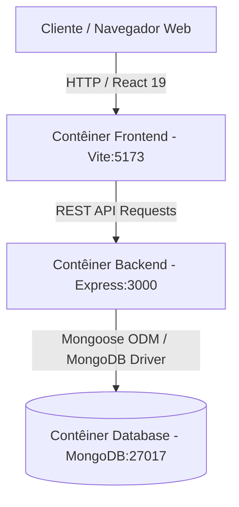
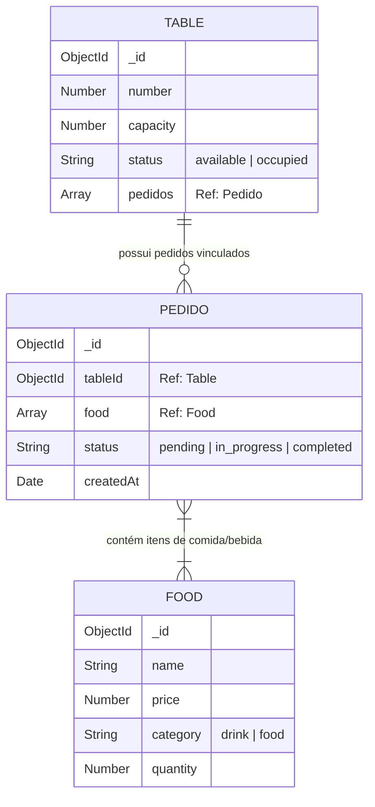

# 🏛️ Arquitetura do Sistema Dinner-Drink

Este documento descreve a arquitetura de software, o modelo de dados e a infraestrutura de contêineres do projeto **Dinner-Drink**.

---

## 📌 Visão Geral da Arquitetura

O **Dinner-Drink** segue uma arquitetura em camadas desacoplada (Client-Server Architecture) conteinerizada via **Docker Compose**:



---

## 🐳 Infraestrutura Docker

A infraestrutura é declarada em [docker-compose.yaml](file:///home/julio/Documentos/Projects/Dinner-Drink/docker-compose.yaml) e é dividida em 3 serviços principais:

| Serviço | Imagem / Build | Porta Interna | Porta Exposta | Dependências |
| :--- | :--- | :--- | :--- | :--- |
| `frontend` | `./frontend` (Node base) | `5173` | `5173` | `backend` |
| `backend` | `./backend` (Node base) | `3000` | `${PORT}` (Ex: 5000) | `db` (com Healthcheck) |
| `db` | `mongo:latest` | `27017` | `27017` | - |

### Healthcheck do Banco de Dados
O contêiner do backend aguarda a inicialização e prontidão do banco de dados antes de ser iniciado:
```yaml
healthcheck:
  test: ["CMD", "mongosh", "--eval", "db.adminCommand('ping').ok", "--quiet"]
  interval: 10s
  timeout: 5s
  retries: 5
  start_period: 30s
```

---

## 🗄️ Modelo de Dados (Mongoose Schemas)

A base de dados é composta por 3 coleções principais conectadas por referências (ObjectIds):



---

## 🔄 Fluxo de Criação e Atualização de Pedidos

1. **Validação de Estoque**: Ao criar um pedido (`POST /pedidos`), o sistema verifica se todos os itens solicitados possuem estoque disponível (`quantity > 0`).
2. **Decremento de Quantidade**: Cada item adicionado ao pedido tem sua quantidade decrementada no modelo `Food`.
3. **Associação com Mesa**: Quando o status do pedido é alterado para `completed` (`PATCH /pedidos/:id`), o ID do pedido é associado ao array `pedidos` da respectiva mesa (`Table`).
